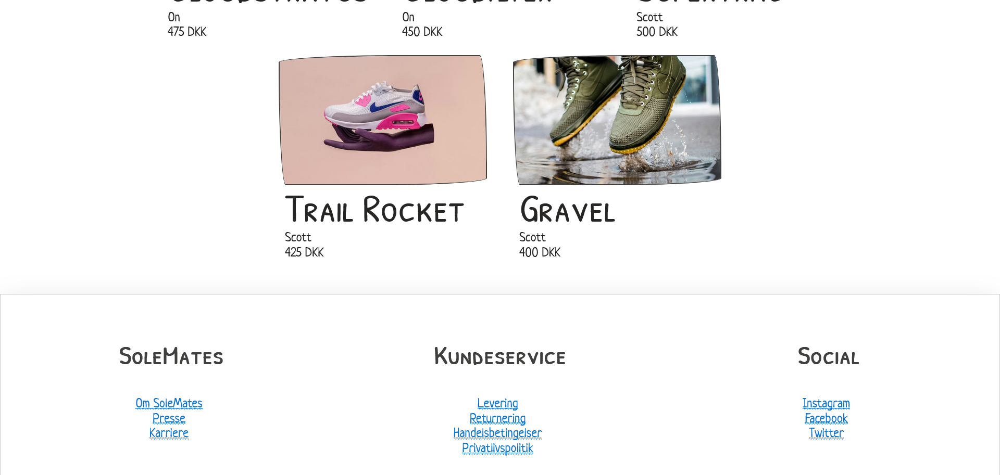

# SoleMates
Webshop developed with ASP.NET, Umbraco and Umbraco Commerce, featuring a custom ERP system,
with cart and order functionality.

Developed by [@benstigsen](https://www.github.com/benstigsen) and [@christiansgh](https://www.github.com/christiansgh)
as the main thesis for an associate's degree in computer science.

## Development
- Download/clone the repository.
- Setup SQL Server with databased `pim` and `erp`
- Change `ConnectionStrings` in `src/Website/appsettings.json`
- Run the application `dotnet run`

## Screenshots

## Notes
The pictures are not owned by us and were only used during development as proof-of-concept.
